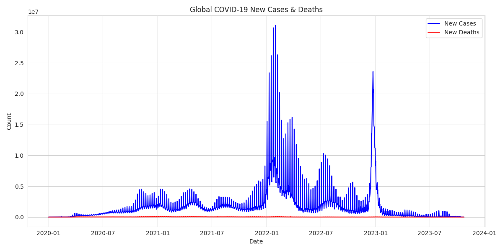
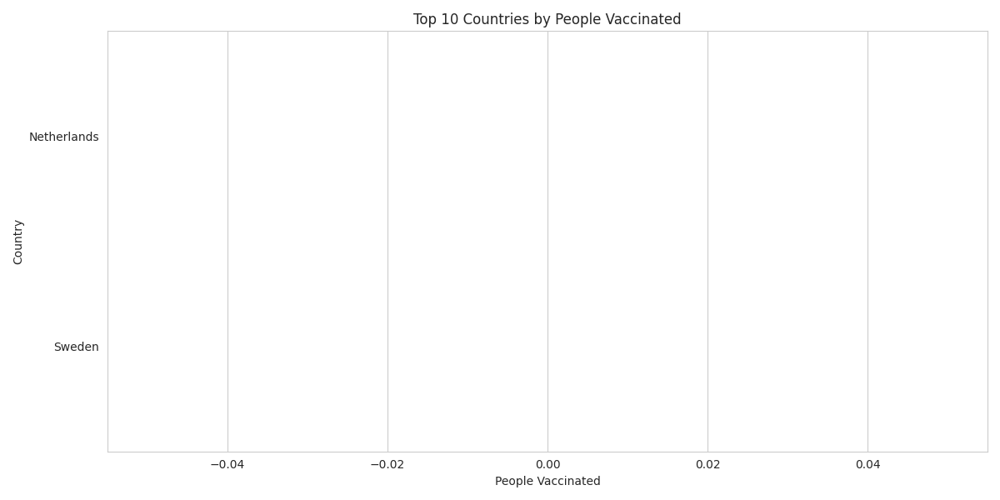
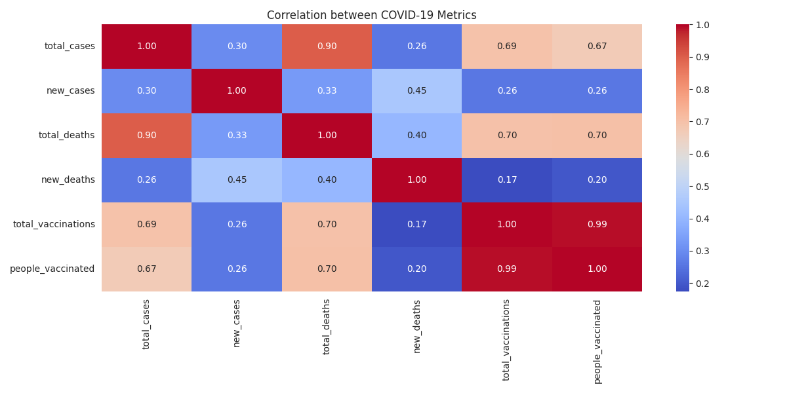

# COVID-19 Dataset Analysis (Data Science Part)

## Project Overview
- **Goal:** Clean, explore, and visualize global COVID-19 data.
- **Scope:** Data Science only (EDA & visualization).  
- File: `data/owid-covid-data.csv`
- Source: [Our World in Data](https://ourworldindata.org/covid-data)
- Key Columns: `date`, `location`, `total_cases`, `new_cases`, `total_deaths`, `new_deaths`, `total_vaccinations`, `people_vaccinated`

## Tools & Libraries
- Python 3
- pandas, numpy, matplotlib, seaborn, plotly

## Methodology
1. **Data Cleaning**
   - Handle missing values
   - Filter irrelevant columns
   - Convert dates
2. **Exploratory Data Analysis**
   - Global trends (cases & deaths)
   - Top affected countries
   - Vaccination progress
3. **Visualization**
   - Line plots, bar charts, heatmaps

---

## Output Graphs

### Global Trends


### Top 10 Countries by Total Cases


### Vaccination Progress


### Correlation Heatmap



## How to Run
1. Activate your virtual environment:

```bash
source .venv/bin/activate
